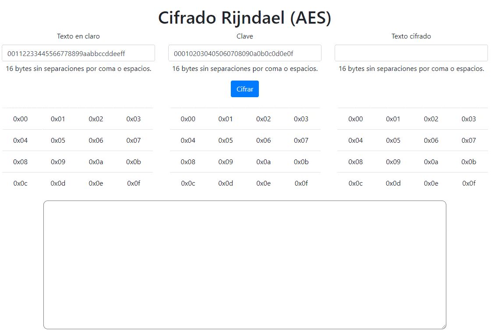
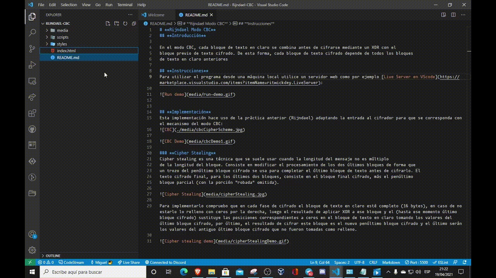
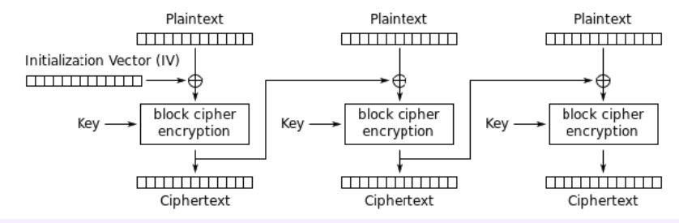
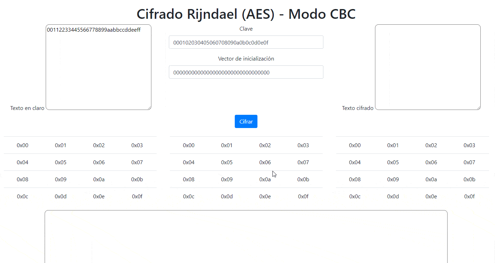
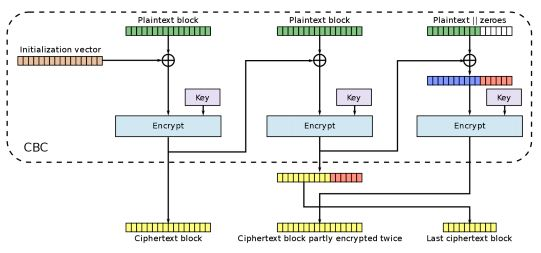
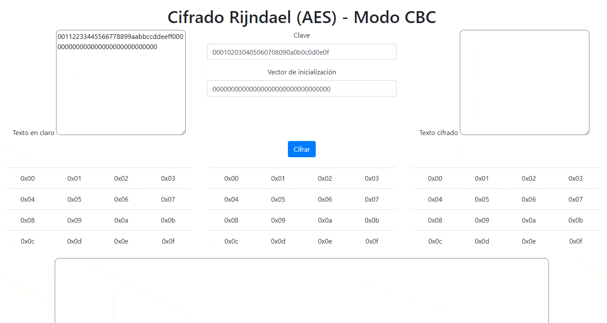
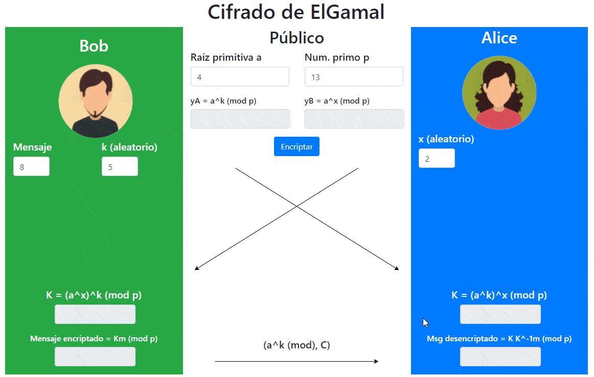

# **Seguridad en sistemas informáticos**
## **Contenidos**

* ### [**Vigenére**](./#el-cifrado-de-vigenère)
* ### [**RC4**](./#generador-rc4)
* ### [**Rijndael (AES)**](./#rijndael)
* * ### [**Rijndael (AES) Modo CBC**](./#rijndael-modo-cbc)
* ### [**ElGamal**](./#elgamal-1)
  

# [**El Cifrado de Vigenère**](sites/VigenereCipher/)
<a href="./sites/Vigenere" target="_blank"><strong>Ir al cifrador</strong></a>

## **Introducción**

El cifrado de Vigenére, también conocido durante un tiempo como *El cifrado indescifrable*, se basa en el funcionamiento del *cifrado César* y la aritmética modular para encriptar mensajes de una forma simple a la vez que robusta. 

La clave está constituida por una secuencia de símbolos del alfabeto K = {k0, k1, ... ,kd-1}, de longitud d, y que emplea la siguiente transformación congruente lineal de cifrado:
```
Ek (mi) = mi + k (i mod d) (mod n)
```


siendo mi el i-ésimo símbolo del texto claro y n el cardinal (longitud) del alfabeto de entrada

Es polialfabético, por lo que la sustitución aplicada a cada caracter varía en función de la posición que ocupe este dentro del texto claro.  

Esta implementación utiliza el alfabeto inglés estándar: de la 'a' a la 'z'.

```
a, b, c, d, e, f, g, h, i, j, k, l, m, n, o , q, r, s, t, u, v, w, x, y, z
```

## **Instrucciones**
Haga click en <a href="./vigenere-site/index.html" target="_blank"><strong>VigenereCipher</strong></a> para ir al cifrador. 


- Todos los mensajes se transforman a minúsculas antes de ser procesados
- Todos los acentos se eliminan, por ejemplo: `à` se transforma en `a`
- Los espacios, saltos de línea, signos de puntuación o signos no pertenecientes al alfabeto son ignorados.
- **Clave**: Por defecto es mision. Para cambiarla modifique el campo correspondiente y presione el botón `Actualizar`
- **Cifrar un mensaje:** Redacte el mensaje a cifrar en el campo `Mensaje` y presione el botón `Cifrar` para que aparezca el mensaje cifrado en el campo `Mensaje Cifrado`. Para copiar el mensaje cifrado al portapapeles presione el botón `Copiar`
- **Descifrar un mensaje:** Redacte el mensaje cifrado en el campo `Mensaje Cifrado` y presione el botón `Descifrar` para que apareza el mensaje descifrado en el campo `Mensaje`.


# [**Generador RC4**](sites/RC4/)
<a href="./sites/RC4" target="_blank"><strong>Ir al cifrador</strong></a>
## **Introducción**
El cifrado RC4 ha sido históricamente el cifrado de flujo más utilizado en el mundo. Fue diseñado por Ronald Rivest en 1987 y fue mantenido en secreto, violando la segunda regla de Kerckhoffs.

Fue publicado de forma anónima en internet el año 1994. Actualmente se puede utilizar con los nombres ARCFOUR, ARC4 y Alledged-RC4.

Es orientado a operaciones con bytes por lo que es bastante rápido en operaciones en software(?).

Ha sido utilizado en diferentes tecnologías como:
- Wi-Fi (WEP y WPA en estándar IEEE 802.11)
- TLS/SSL (navegación segura por internet)
- SSH (intérprete para conexión a máquinas remotas)
- Kerberos (servidor centralizado para autenticación en redes)
- Whatsapp, Skype, cifrado de pdf, etc...


## **Implementación**
Esta implementación consta de un módulo llamado `RC4` cuyos métodos principales son:
- **`ksa`** *Key Scheduling Algorithm*: recibe la clave e inicializa y permuta el vector de estados del encriptador así como el vector k utilizado para generar la secuencia cifrante.
- **`prga`** *Pseudo Random Generation Algorithm*: Recibe el mensaje (en este caso tomaremos los mensaje como vectores de números enteros en base decimal, cada uno representará un byte) y aplica el algoritmo de encriptación.
- **`apply`** : Recibe el mensaje a ser procesado y la clave y aplica el algoritmo completo al mismo para luego devolverlo procesado.


## **Instrucciones**
La clave y el mensaje se presentan como una lista de números enteros en base decimal separados por coma. Pulse **Aplicar** para aplicar el cifrado RC4 al mensaje con la clave especificada.

En la ventana **Pasos** se imprime paso paso el proceso de encriptación RC4.
## **Ejemplo de uso**


# [**Rijndael**](sites/Rijndael/)
<a href="./sites/Rijndael" target="_blank"><strong>Ir al cifrador</strong></a>
## **Introducción**

El algoritmo Rijndael es un sistema simétrico de cifrado por bloques, por tanto utiliza la misma clave para el proceso de cifrado como para el proceso de descifrado. Su diseño permite la utilización de claves de sistema con longitud variable siempre que sea múltiplo de 4 bytes. La longitud de las claves utilizadas por defecto son 128 (AES-128), 192 (AES-192) y 256 (AES-256) bits. De la misma manera el algoritmo permite la utilización de bloques de información con un tamaño variable siempre que sea múltiplo de 4 bytes, siendo el tamaño mínimo recomendado de 128 bits (el tamaño mínimo de 16 bytes).

Este algoritmo opera a nivel de byte, interpretando éstos como elementos de un cuerpo de Galois GF(28), y a nivel de registros de 32 bits, considerándolos como polinomios de grado menor que 4 con coeficientes que son a su vez polinomios en GF(2 ).

## **Implementación**
Esta implementación funciona con bloques de 128 bits. Tiene como entrada el bloque del mensaje en claro y el bloque de la clave y da como resultado el bloque cifrado así como la subclaves y estado en cada una de las iteraciones. 

La disposición de los bytes de entrada es por columnas es decir: 
La matriz  

| 0 | 1 | 2 | 3 |
|---|---|---|---|
| 4 | 5 | 6 | 7 |
| 8 | 9 | a | b |
| c | d | e | f |

Sería introducida como: `0004080c0105090d02060a0e03070b0f`



# [**Rijndael Modo CBC**](sites/Rijndael-CBC/)
<a href="./sites/Rijndael-CBC" target="_blank"><strong>Ir al cifrador</strong></a>
## **Introducción**

En el modo CBC, cada bloque de texto en claro se combina antes de cifrarse mediante un XOR con el
bloque previo de texto cifrado. De esta forma, cada bloque de texto cifrado depende de todos los bloques
de texto en claro anteriores

## **Instrucciones**
Para utilizar el programa desde una máquina local utilice un servidor web como por ejemplo [Live Server en VScode](https://marketplace.visualstudio.com/items?itemName=ritwickdey.LiveServer): 



Una vez dentro de la aplicación introduzca los bloques de texto a cifrar. Serán bloques de bytes , múltiplos o no de 16 bytes, de la forma XY, por lo que todo bloque tendrá que ser de longitud par (cada byte está conformado por dos caracteres). 

Al presionar **cifrar** podrá ver como se crean tres matrices: texto en claro, clave y texto cifrado, además el texto cifrado se mostrará también en el recuadro de la derecha.

En el recuadro del fondo de la página podrá observar los pasos seguidos, así como las entradas y salidas del programa.

## **Implementación**
Esta implementación hace uso de la práctica anterior (Rijndael) adaptando la entrada al cifrador para que se corresponda con el mecanismo del modo CBC:




### **Cipher Stealing**
Cipher stealing es una técnica que se suele usar cuando la longitud del mensaje no es múltiplo
de la longitud del bloque. Consiste en modificar el procesamiento de los dos últimos bloques de forma que
un trozo del penúltimo bloque cifrado se usa para completar el último bloque de texto antes de cifrarlo. El
texto cifrado final, para los últimos dos bloques, consiste en el bloque final cifrado, más el penúltimo
bloque parcial (con la porción "robada" omitida).



Para implementarlo compruebo que en cada fase de cifrado el bloque de texto en claro esté completo (16 bytes), en caso de no estarlo lo relleno con ceros por la derecha, luego el resultado de aplicar XOR a ese bloque y el (hasta ese momento último bloque cifrado) sustituye las posiciones correspondientes a ceros en el bloque de texto en claro tomando los valores del último bloque cifrado, por último, el resultado de cifrar este bloque es el nuevo penúltimo bloque cifrado y el último serán los valores del antiguo último bloque cifrado que no fueron tomadas como relleno.




# [**ElGamal**](sites/ElGamal/)
<a href="./sites/ElGamal" target="_blank"><strong>Ir al cifrador</strong></a>

  
## **Introducción**
El procedimiento de cifrado/descifrado ElGamal se refiere a un esquema de cifrado basado en el problema matemático del logaritmo discreto. Es un algoritmo de criptografía asimétrica basado en la idea de Diffie-Hellman y que funciona de una forma parecida a este algoritmo discreto.

## **Instrucciones**
* En la columna del centro se encuentran los datos publicos: 
  * **Raíz primitiva a**
  * **Número primo p**
  * **yA**: Valor público enviado por A
  * **yB**: Valor público enviado por B
* En la columna de la izquierda se encuentran los datos conocidos por el emisor:
  * c
  * **k**: Número privado aleatorio elegido por el emisor
  * **K**: Clave compartida con el receptor
  * **Mensaje encriptado**
* En la columna de la izquierda se encuentran los datos conocidos por el receptor:
  * **x**: Número privado aleatorio elegido por el receptor.
  * **K**: Clave compartida con el emisor
  * **Msg desencriptado**: mensaje descifrado 
  
Indique los valores de entrada **Raíz primitiva a**, **Número primo p**, **Número primo p**, **k** y **x**. Luego presione **Encriptar** :

