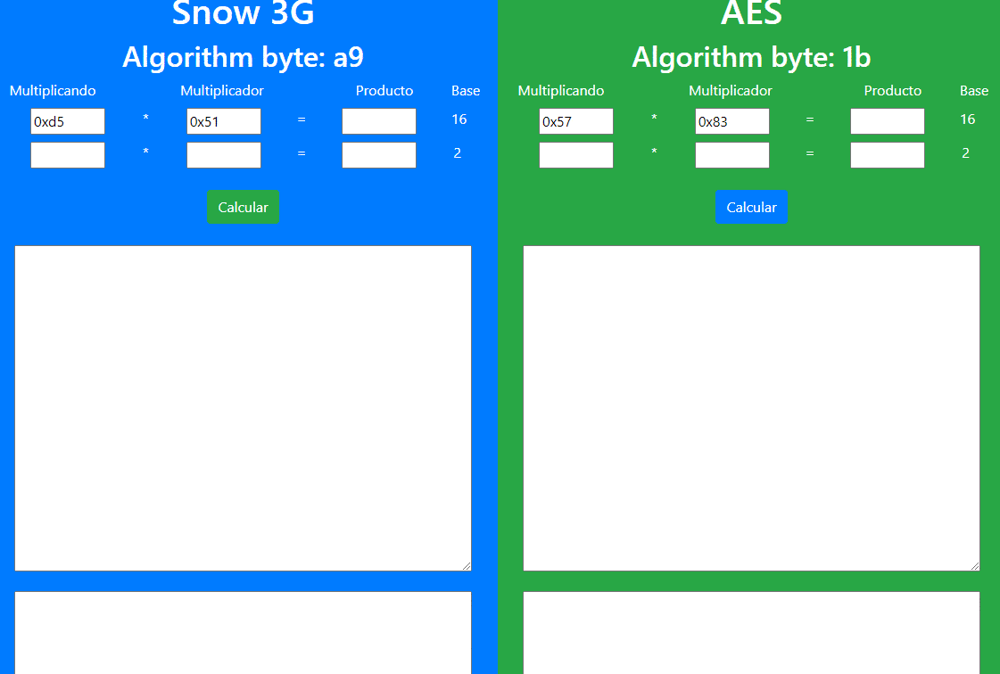
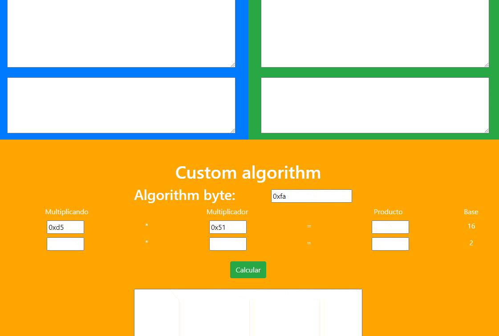

# [**Ir al multiplicador**](./site/index.html)
Multiplicación en Snow3g y AES

## **Introducción**

En el cifrado en flujo **SNOW 3G** las dos multiplicaciones de 32 bits por 32 bits implicadas en el LFSR se corresponden con productos de polinomios en módulo **`x^8 + x^7 + x^5 + x^3 + 1`**, que pueden ser implementadas como una sucesión de desplazamientos de bytes y XORs con el byte **`0xa9=10101001git`**.  

En el **AES**,  la multiplicación de bytes utilizada se corresponde con el producto de polinomios en módulo **`x^8 + x^4 + x^3 + x + 1`**, que puede ser implementado como una sucesión de desplazamientos de bytes y XORs con el byte **`0x1b=000110112`**.  

Ambos casos implican aplicar la operación distributiva sobre los dos bytes multiplicandos, usando para ello el byte de menor peso, y luego para cada bit 1 de ese byte,desplazar a izquierda el otro byte, de forma que cada vez que su bit más significativo antes del desplazamiento sea 1, hay que hacer, tras el desplazamiento, una *XOR* bit a bit con el byte A9 o 1B. 

## **Implementación**

Esta implementación consta de una 'clase' `ByteMultiplier`, cuyas características principales son el atributo `byteAlgorithm` y el método `multiply`. Al crear una instancia de la clase se define el byte que se utilizará para realizar las multiplicaciones según el algorimto. Por otro lado, el método `multiply` recibe dos números enteros y devuelve otro entero como resultado de realizar la multiplicación de los bytes menos significantes de los parámetros.

Como se mencionó anteriormente, de cara al usuario se trabaja con bytes, pero internamente estos son convertidos a `Array` de unos y ceros que representan los bytes.

## **Interfaz de usuario**

Para usar el multiplicador simplemente indique los operandos y presiona **`Calcular`**. A continuación, podrá ver el restultado de la multiplicación, la representación en binario de cada uno de los operandos y el resultado así como también los pasos seguidos durante el cálculo de la multiplicación.

En el área de texto principal se muestra los factores en los que se descompone el multiplicador, mientras que en el área de texto secundaria se muestra los pasos seguidos en cada una de las multiplicacione `multiplicando * factor`.

Además, también está la opción de especificar un byte de algoritmo personalizado para realizar la multiplicación:

