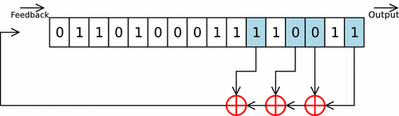
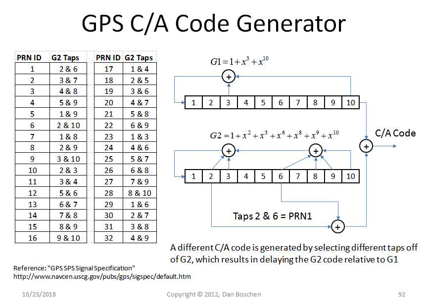
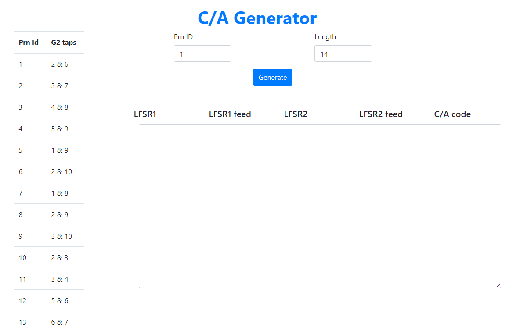

# [**Ir al generador**](./site/index.html)
## **Introducción**
El Código de Adquisición Aproximativa C/A se utiliza en el servicio estándar de posicionamiento para uso civil.Se trata de una secuencia de 1023 bits que se repite cada milisegundo, y que es diferente para cada satélite.

Utiliza 2 registros de desplazamiento con retroalimentación lineal o *LFSRs*, que son generadores de secuencias binarias pseudoaleatorias en los que cada casilla de la estructura se inicializa con un bit y a cada golpe de reloj se realimenta con un bit producido mediante XORs definidos por la estructura.

El generador C/A emplea dos de estos vectores de la siguiente forma:

Donde G1 y G2 son fijos y el id del satélite permite identificar las posiciones que se utilizarán para realizar la operación.

## **Simulador**

Este simulador presenta una lista de ids de satélites cada uno con su respectivo par de posiciones (*G2taps*) especificadas para realizar la operación.

Toma como entradas el id del sateñlite y la longitud deseada del código a generar.

Genera como salida la secuencia C/A así como cada uno de los pasos seguidos para generarla.

