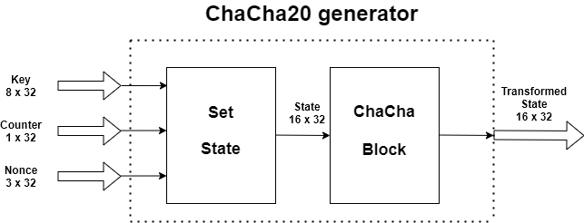
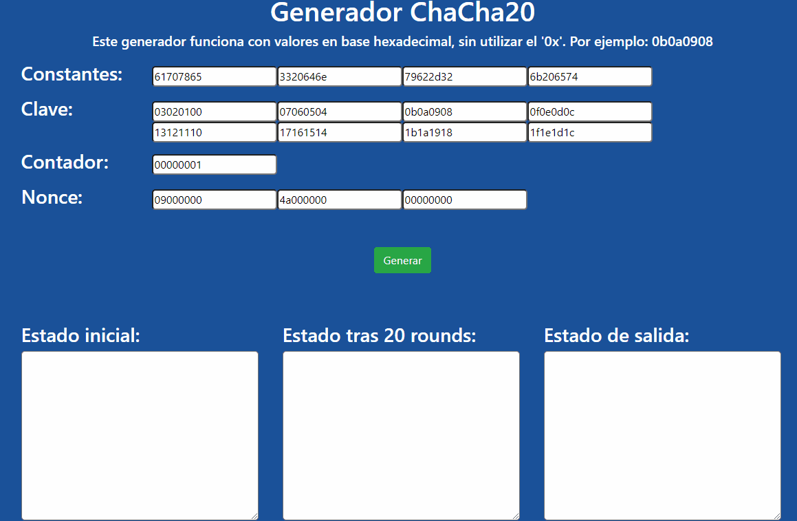

# [**<u>Ir al generador</u>**](./site/index.html)
## **Introducción**
El cifrado ChaCha20 es un cifrado en flujo desarrollado en el 2008 por Daniel Bernstein a partir del cifrado Salsa20.

Al igual que Salsa20, se basa en una función pseudoaleatoria basada en operaciones add-rotate-XOR (ARX): operaciones de suma de 32 bits, suma a nivel de bits (XOR) y rotación a nivel de bits. La función principal asigna una clave de 256 bits, un nonce (número arbitrario usado solo una vez) de 64 bits y un contador de 64 bits a un bloque de 512 bits del flujo de clave (*keys tream*) (también existe una versión Salsa con una clave de 128 bits). Esto le da a Salsa20 y ChaCha la inusual ventaja de que el usuario puede buscar eficientemente cualquier posición en el flujo de claves en tiempo constante.

## **Implementación**
Esta implementación siguel el [**RFC7539**](https://tools.ietf.org/html/rfc7539), según el cual, el contador original de 64 bits y el nonce original de 64 bits son sustituidos por un contador de 32 bits y un nonce de 96 bits

### **Instrucciones**
- Trabaja con palabras de 32 bits en hexadecimal, sin el `0x`
- Pulse `Generar` para generar los estados.
- **Estado inicial:** el estado resultante de encadenar las constantes, la key, el contador y la nonce
- **Estado tras 20 rounds:** estado resultante tras someter el estado inicial a 20 iteraciones de la función `chachaBlock`
- **Estado de salida:** estado resultante de sumar palabra a palabra `Estado inicial` y `Estado tras 20 rounds`.

# [**<u>Ir al generador</u>**](./site/index.html)

